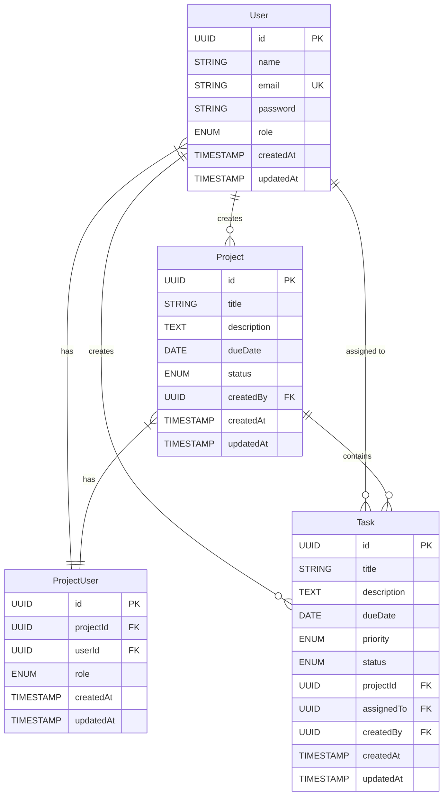

# Database Schema Diagram



## Table Descriptions

### User

- Primary table for user information
- Stores authentication details and user profile
- Role can be either 'user' or 'admin'

### Project

- Represents a project in the system
- Contains project details and status
- Linked to creator through createdBy foreign key
- Status can be 'active', 'completed', or 'on_hold'

### Task

- Represents individual tasks within projects
- Contains task details, priority, and status
- Linked to project through projectId
- Linked to assignee through assignedTo
- Priority can be 'low', 'medium', or 'high'
- Status can be 'todo', 'in_progress', or 'completed'

### ProjectUser

- Junction table for many-to-many relationship between Users and Projects
- Stores project membership information
- Role can be 'member' or 'admin'

## Relationships

1. User to Project (One-to-Many)

   - A user can create multiple projects
   - Each project has one creator

2. User to Task (One-to-Many)

   - A user can create multiple tasks
   - A user can be assigned to multiple tasks
   - Each task has one creator and one assignee

3. Project to Task (One-to-Many)

   - A project can have multiple tasks
   - Each task belongs to one project

4. User to ProjectUser (One-to-Many)

   - A user can be a member of multiple projects
   - Each project membership record belongs to one user

5. Project to ProjectUser (One-to-Many)
   - A project can have multiple members
   - Each project membership record belongs to one project

## Indexes

1. User

   - Primary Key: id
   - Unique Index: email

2. Project

   - Primary Key: id
   - Foreign Key: createdBy
   - Index: status

3. Task

   - Primary Key: id
   - Foreign Keys: projectId, assignedTo, createdBy
   - Indexes: status, priority

4. ProjectUser
   - Primary Key: id
   - Foreign Keys: projectId, userId
   - Unique Index: (projectId, userId)

```

```
